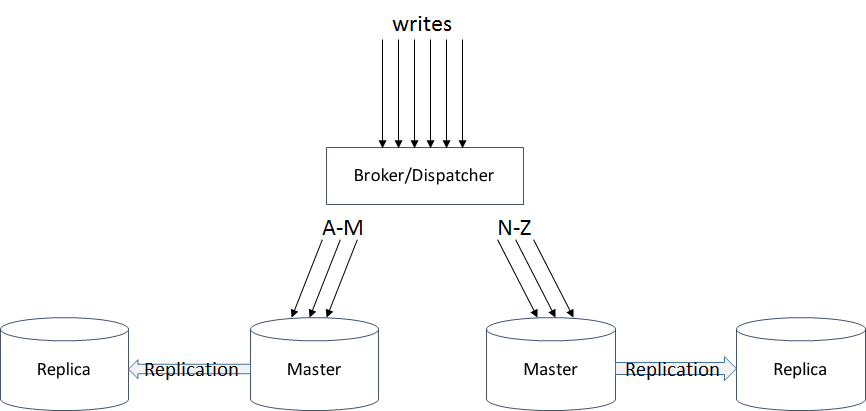

# 分布式系统

[分布式计算原理（讲稿合集）](http://dcg.ethz.ch/lectures/podc_allstars/)

分布式系统的终极问题：如何确保一致？

核心算法： Paxos

### CAP 定理
一个分布式系统必须在一致性(Consistency)、可用性(Availability)和分隔容忍度（Partition tolerance）之间取舍，并且只能做到三者中的两者。(注意，三个维度都应该理解为范围，而不是布尔值)

分布式系统最大的问题可能并不是延迟，而是部分机器宕机（尤其是单点故障），因此分布式系统设计需要'design for failure'（容灾设计）.

针对数可能丢失问题，一般的做法是数据的冗余存储，也就是存储多个副本，例如 hadoop 默认备份3份

数据一致性的保证： 事务
系统性能

- 拜占庭将军问题

### 分布式数据存储

关系型数据库(RDB)支持**高度一致性**事务，然而在互联网等领域，相比一致性，**可用性**、**性能**、**可扩展性**可能会更为重要。

关系型数据库围绕着 ***ACID*** 的概念而建立，实现 ACID 的最简单方法就是将一切都保持在单机上，因此，传统的 RBD 通常只能垂直型扩展。

##### Partitioned Replica Set

##### 参考
- [讲给普通人听的分布式数据存储](http://www.kuqin.com/shuoit/20150925/348279.html)
