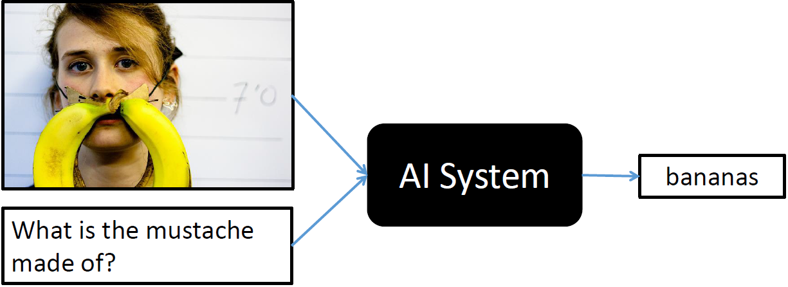

# 问答系统专题

本章包含的问题，严格来说并不都是问答相关的，但均为自然语言处理和计算机视觉的交叉领域。

问题的三种类型：what(who, when, where等实体事实型), how, why

### 图片描述(Image Caption)专题

图片描述相比图片分类，物体识别等其他问题，是较为困难的，因为一方面要对图片中的场景做准确的理解，不仅要识别物体，还要识别物体之间的关联以及所属的活动，并且需要对时空关系等做一定的推断，一方面还需要结合自然语言处理对信息做一定的归纳之后生成文本描述，属于*交叉问题*（类似的还有图片问题回答）。

- [MS COCO Captioning Challenge](http://mscoco.org/dataset/#captions-challenge2015)

    比赛于2015年4月开始，5月结束（但测评服务目前仍然开放），7月份在 CVPR 2015 Large-scale Scene Understanding workshop 宣布结果。采用人工裁判，排在第一的还是人，后面两名则分别来自谷歌和微软（打了个平手）。

- [Neural Storyteller](https://github.com/ryankiros/neural-storyteller)

     所谓的看图说话。相关示例参考博文[Generating Stories About Images](https://medium.com/@samim/generating-stories-about-images-d163ba41e4ed#.6heufs6ms)

- [Neural Artistic Captions](http://www.cs.toronto.edu/~rkiros/adv_L.html)

    诸多图片故事的例子。

- [Show and tell: A Neural image Caption Generator, by Oriol Vinyals, et al., Google, 2014](http://arxiv.org/abs/1411.4555)
    借鉴机器翻译中 RNN-RNN 这样端到端的方式，将编码的 RNN 替换为CNN（因为 CNN 久经考验，已经被公认能够为输入图片产生丰富的表示，然后只要将此表示嵌入一个定长向量，后面能做的事情就非常多了），即成 CNN - RNN, 称此模型为NIC(neural iamge caption).

代码实现
karpathy 大神的[neuraltalk](https://github.com/karpathy/neuraltalk) 以及其进化版[neuraltalk2](https://github.com/karpathy/neuraltalk2). neuraltalk 是用 python 实现的，而 neuraltalk2 用 torch 并运行在 GPU 上, 因此后者的速度比前者有显著的提升。新图片的 CNN feature 用 VGG 架构提取（得到顶层的4096维的激活子）。

- [Show, Attend and Tell: Neural Image Caption Generation with Visual Attention](http://arxiv.org/abs/1502.03044)

- [Neural Generative Question Answering by Jun YIn, et al., 2015](http://arxiv.org/abs/1512.01337)

    仍然是标配：端到端的编码和解码　＋　注意机制

数据

Flicker8k, Flicker30k, MS-COCO

---

### 视频描述

视频内容描述是图片内容描述的自然延伸，在视频搜索，人机交互，为视力缺陷者讲述内容等场景中均有切实的需求。

图片的内容描述，最后生成的句子长度是不定长的，在视频描述中，多了一个不定长的变量：图片帧的个数。此外，现实视频中的物体繁多，场景多样，动作各异，这为视频内容描述带来了不小的困难。如何识别出最主要的内容也是难点，因为我们只想描述视频中最主要的部分，而不是面面俱到。

LSTM 模型的成功。

后来又加入了 attension(注意机制)

- [action recognition using visual attension](http://shikharsharma.com/projects/action-recognition-attention/)

    基于 soft attension 模型的视频中动作识别。

- [Sentence to Sequence -- Video to Text](http://arxiv.org/abs/1505.00487v3)

    2015.10. 基于 (video, sentence) pair 训练出 LSTM 模型，称为 S2VT，video 包括像素值和相邻帧的光流。

基准视频数据集
1. MSVD (microsoft video description corpus)
2. MPII-MD (MPII movie description dataset)
3. M-VAD (montreal video annotation dataset)

- [LSMDC 2015](https://sites.google.com/site/describingmovies/)

    The Large Scale MOvie Description Challenge, at ICCV 2015.

### VQA(Visual Question Answering)

基于视觉的问题回答，包括回答一些关于图片或者视频的问题，对实现人机交互的智能梦想具有重要意义。本文中我们只考虑图片的问题，视频的以后再说。

一般而言，要回答提问者关于图片的问题，首先需要对图片中的场景和物体做出准确的识别，这就需要机器视觉方面的技术，例如物体检测，图像分割(image segmentation)等；其次，提问和回答一般都是以文字的形式（如果是语音，还要依赖语音识别技术转化为文字），因此还需要自然语言处理相关的技术。由于需要**机器视觉**和**自然语言处理**两大技术协同作战，VQA 需要的智能程度是相当高的，因此也被认为可以取代图灵测试来衡量智能水平。

问题的类型大致包括：主体(waht)，数量，颜色，位置

进一步，如果问题的回答需要一定程度的逻辑推理呢？

- [VQA 挑战](http://www.visualqa.org/)

    超过25万张图片，75万个问题，值得关注！下面是一个例子
    

- [VQA_ICCV2015](http://www.visualqa.org/VQA_ICCV2015.pdf)

DAQUAR 数据集，大约含1500张图片，关于37类物体的约7000个问题。

- [Exploring Models and Data for Image Question Answering, by Mengye Ren, et al., NIPS 2015(to appear)](http://arxiv.org/abs/1505.02074)

    一篇综述文章,，代码[在此](https://github.com/renmengye/imageqa-publi)
    利用视觉语义嵌入(visual semantic embeddings) 连接 CNN 和 RNN.
    还附带了一个将原有的图片描述转换为 QA 的算法，由此可以生成大量的数据集供使用，例如文中将 MS-COCO 数据集扩展为 MS-COCO-QA.
    假定回答只是一个单词，并将问题理解为分类问题，这是比较局限的地方。

    起初我觉得这种方式的回答是有问题的：当算法返回说沙发上是枕头的时候，它其实并没有对枕头做出识别，而仅仅是因为训练数据中，沙发上有枕头的比较多！可是后来一想：算法是怎么知道沙发上的枕头比较多的呢，不还是因为它对沙发和枕头有一定的识别能力吗！

- [Simple Baseline for Visual Question Answering by Bolei Zhou, et al., 2015](http://arxiv.org/abs/1512.02167)

    [代码在此](https://github.com/metalbubble/VQAbaseline)

---

### 多模态专题(Multimodal)

多模态指将文本与图像/音频/视频等结合

- [Unifying Visual-Semantic Embeddings with Multimodal Neural Language Models, by Ryan Kiros, et al. 2014](http://arxiv.org/abs/1411.2539)

    先八卦几句。作者 Ryan Kiros 是 Toronto 大学博士，导师为 Ruslan Salakhutdinov （2016年就要去 CMU 了）和 Richard Zemel.
    他们以及 YuKun Zhu(本硕在上交) 等人构成了自然语言处理和计算机视觉领域的 Toronto 帮派。Ryan Kiros 本人在 github 上的3个[代码库](https://github.com/ryankiros?tab=repositories)（分别是neural-storyteller, skip-thoughts, bisual-semantic-embedding）均获得了大量的赞.后者正是该文的伴随代码。

     该文的一大惊艳成果
     > *image of a blue car* - "blue" + "red" is near images of red cars.

- [多模态的语言学规律(multimodal linguistic regularities)](http://www.iro.umontreal.ca/~bengioy/cifar/NCAP2014-summerschool/slides/ryan_kiros_cifar2014kiros.pdf)

- [Order-Embeddings of Images and Language by Ivan Vendrov, et al., 2015, ICLR 2016, under review](http://arxiv.org/abs/1511.06361)

    图片和语言的有序嵌入. 上位词、文本蕴含、图片描述，其实都可以视为在建模层次结构。该层次结构又有明显的偏序结构，可以用 *偏序表示* 来刻画，本文提出了一种获得偏序表示的方法。

    偏序结构并不具有对称性，所以作者认为嵌入空间中使用对称的相似距离测度（例如欧几里得距离）会带来系统性误差。

    一般嵌入的时候，都要求嵌入映射是保距的，因为我们希望原空间中相似的物体在嵌入空间中也相似，但作者认为，在建模偏序结构时，*与其保距，不如保序*。

- [Multimodal Convolutional Neural Networks for Matching Image and Sentence by Lin Ma, et al., ICCV 2015](http://arxiv.org/abs/1504.06063)

    提出了多模态卷积神经网络模型(m-CNNs)，用以图片和句子的匹配。

- [Aligning Books and Movies:
Towards Story-like Visual Explanations by Watching Movies and Reading Books　by YuKun Zhu, et al., 2015](http://www.cs.toronto.edu/~mbweb/)

